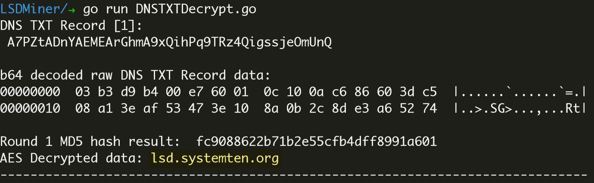

# LSDMiner_DNS_TXT_Decrypt
**Decrypt DNS TXT data that encrypted by AES128bit of botnet lsdminer malicious sample**

The latest malicious sample of LSDMiner uses DNS TXT as it's CC tunnel. It delivers multiple kinds of data encrypted by AES128bit via DNS TXT record. Now this is the decryption sccript.

Related blog post:

1. https://www.anomali.com/blog/illicit-cryptomining-threat-actor-rocke-changes-tactics-now-more-difficult-to-detect

**Usage**:

